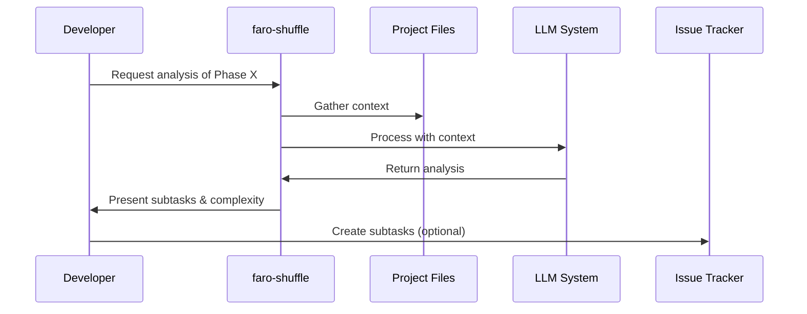

# faro-shuffle: AI-Powered Task Complexity Analysis & Expansion

## 1. Context & Goals

faro-shuffle is an AI-powered system designed to analyze task complexity and automatically break down large tasks into manageable subtasks. It integrates with existing project management workflows to provide:

- Automated complexity assessment of project phases/tasks
- Intelligent decomposition of complex tasks into atomic subtasks
- Standardized inputs and outputs that work across different project structures
- Integration with editor workflows via MCP (Message Control Protocol)

**Problem Statement:** Software development tasks are notoriously difficult to estimate accurately. Large tasks often hide complexity that only becomes apparent during implementation, leading to missed deadlines and scope creep. Manual task breakdown is time-consuming and prone to oversight.

**Target Audience:** Software development teams, project managers, and individual developers working with task-based workflows.

**Success Metrics:**
- Reduction in estimation errors by 30%
- Decrease in blocked/stalled tasks by 25% 
- Increase in sprint completion rates by 20%
- Developer satisfaction with task clarity (measured via surveys)

## 2. User Roles and Key Features

### Roles

| Role | Description | Primary Goals |
|------|-------------|--------------|
| Developer | Individual working on implementation tasks | Get clear, atomic subtasks; Better understand complexity |
| Project Manager | Oversees project progress and planning | Get accurate estimates; Identify risk areas; Plan sprints effectively |
| Technical Lead | Makes technical decisions and guides implementation | Identify architectural impacts; Ensure proper task dependencies |
| AI Agent | Automated systems using the faro-shuffle API | Generate subtasks programmatically; Incorporate into workflows |

### Key Features

1. **Task Complexity Analysis**
   - Analyze tasks against standardized complexity factors
   - Generate numerical complexity scores with confidence levels
   - Identify risk areas and potential blockers

2. **Intelligent Task Decomposition**
   - Break down complex tasks into logical subtasks
   - Establish dependencies between subtasks
   - Estimate effort for each subtask

3. **Integration & Automation**
   - Editor plugins via MCP (Message Control Protocol)
   - CLI interface for command-line workflows
   - Standardized JSON output format
   - Markdown report generation

4. **Project Context Awareness**
   - Understand project structure and technology stack
   - Consider existing code patterns and conventions
   - Analyze related files and dependencies

## 3. User Flows

### Developer Flow
1. **Analysis Request:** Developer selects a task/phase for analysis via editor command or CLI
2. **Context Gathering:** System examines relevant files, project structure, and previous tasks
3. **LLM Processing:** Task is analyzed by LLM with project-specific context
4. **Review Results:** Developer reviews generated subtasks and complexity assessment
5. **Task Management:** Subtasks are created in issue tracker (optional integration)



### Project Manager Flow
1. **Bulk Analysis:** PM selects multiple tasks/phases for analysis
2. **Resource Planning:** System provides total effort estimates and identifies high-risk areas
3. **Sprint Planning:** PM uses subtask breakdown to assign work or adjust timelines
4. **Progress Tracking:** Subtask completion provides granular progress visibility

## 4. UI/UX Layout and Navigation

### CLI Interface
- Simple command structure: `faro-shuffle analyze <phase-id> [options]`
- Output to console (formatted text) or file (JSON/Markdown)
- Progress indicator during analysis
- Clear, color-coded results presentation

### Editor Integration (via MCP)
- Command palette entry: "Analyze Current Task/Phase"
- Sidebar panel displaying results
- Inline annotations showing subtask boundaries
- Context menu options on task identifiers

### Web Interface (Future)
- Dashboard showing project-wide complexity metrics
- Kanban-style view of tasks and subtasks
- Filtering by complexity, risk level, and dependencies
- Integration with issue trackers (GitHub, JIRA)

## 5. Accessibility & Inclusivity

- CLI output compatible with screen readers
- Editor integration follows editor accessibility guidelines
- Color choices account for colorblindness with secondary indicators
- All interactions available via keyboard shortcuts
- Command syntax follows consistent, predictable patterns
- Output available in multiple formats (text, markdown, JSON)

## 6. Technical Approach & Scalability

### Architecture

```
+------------------+     +------------------+     +----------------+
| Input Interfaces | --> | Core Analysis    | --> | Output Formats |
| - CLI            |     | - Context Parser |     | - JSON         |
| - MCP Module     |     | - LLM Client     |     | - Markdown     |
| - API            |     | - Task Analyzer  |     | - Console      |
+------------------+     +------------------+     +----------------+
                               |
                               v
                         +----------------+
                         | LLM Providers  |
                         | - Ollama       |
                         | - Claude       |
                         | - OpenAI       |
                         +----------------+
```

### Technology Stack
- **Core:** Rust for performance and reliability
- **LLM Integration:** Multiple provider support with fallbacks
- **Editor Integration:** MCP protocol (compatible with Vim, VSCode, etc.)
- **Configuration:** TOML files for persistent settings

### Scalability Considerations
- Asynchronous processing for large tasks or bulk analysis
- Caching of analysis results to reduce LLM costs
- Modular design allowing for easy addition of new input/output formats
- API rate limiting and queueing for shared instances

## 7. Data Privacy & Security

- Local-first approach with no data sent to external services by default
- LLM provider configuration with optional local-only mode (Ollama)
- Clear disclosure of what project data is used for analysis
- No storage of analysis results unless explicitly requested

## 8. Implementation Roadmap

### Phase 1: Core Analysis Engine
- Implement basic task parsing and context gathering
- Develop LLM prompting strategy for complexity analysis
- Create JSON output format and basic console reporting

### Phase 2: CLI Interface
- Build command-line interface with argument parsing
- Implement configuration file support
- Add multiple output format options

### Phase 3: MCP Integration
- Develop MCP module architecture
- Implement editor communication protocol
- Create Vim plugin interface

### Phase 4: Advanced Features
- Machine learning to improve estimates based on actual completion times
- Integration with issue trackers (GitHub, JIRA)
- Historical analysis and trends

## 9. Risks & Mitigation

| Risk | Impact | Likelihood | Mitigation |
|------|--------|------------|------------|
| LLM output inconsistency | High | Medium | Structured prompts, validation, fallback logic |
| Project context misinterpretation | Medium | Medium | Explicit context inclusion, confidence scoring |
| Overreliance on automatic estimates | Medium | High | Clear confidence indicators, human review emphasis |
| Performance bottlenecks | Low | Low | Async processing, caching, optimization |
| Privacy concerns | High | Low | Local-first approach, transparency, configuration |

## 10. Conclusion

faro-shuffle will provide a significant boost to development productivity by automating the complex, error-prone process of task breakdown and estimation. By leveraging AI to identify hidden complexity and generate structured subtasks, the system enables more accurate planning, clearer developer instructions, and better progress tracking.

The modular, extensible design ensures it can integrate with existing workflows via MCP, CLI, or future integrations, while the emphasis on local processing and privacy addresses common concerns with AI tools. The phased implementation approach allows for incremental delivery of value while building toward a comprehensive task management solution. 