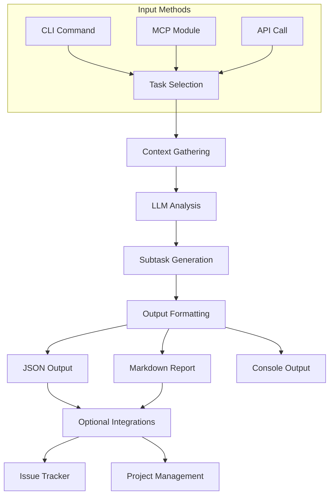

# 🃏 faro-shuffle

**Know instantly if your project is a 2-hour tweak or a 2-week trap—before you waste time.**

`faro-shuffle` is an AI-powered task complexity analyzer that helps developers, freelancers, and project managers avoid time estimation disasters. It uses local AI to analyze your task descriptions and provide an objective complexity score with rationale.

## The Problem

Ever wasted 12 hours on a task that *should've* taken 2? Or worse, started something that turned into a 2-week nightmare?

Task complexity is notoriously difficult to estimate. We tend to:
- Underestimate complex tasks (optimism bias)
- Overlook hidden dependencies
- Miss edge cases that explode complexity

## The Solution

`faro-shuffle` tells you up front how hard a task really is—and why—before you commit to it:

- **Simple CLI workflow**: Write your task in markdown, get an instant complexity score
- **Local AI analysis**: Uses your Ollama instance for privacy and speed
- **Actionable insights**: Get recommendations based on complexity score
- **No configuration needed**: Works out of the box with sensible defaults

## Installation

### Prerequisites

- Rust toolchain (install via [rustup](https://rustup.rs/))
- [Ollama](https://ollama.ai/) running locally with the `llama3` model

```bash
# Install Ollama if you haven't already (macOS example)
curl -fsSL https://ollama.ai/install.sh | sh

# Pull the llama3 model (if you don't have it)
ollama pull llama3

# Make sure Ollama is running
ollama serve
```

### Building from Source

```bash
# Clone the repository
git clone https://github.com/your-username/faro-shuffle.git
cd faro-shuffle

# Build the project
cargo build --release

# Move binary to your path (optional)
cp target/release/faro_shuffle /usr/local/bin/faro-shuffle
```

## Usage

1. Create a markdown file with your task description:

```markdown
# Add User Authentication to Web App

Need to implement user authentication for the web application. Should include:
- Login form with email/password
- Registration flow
- Password reset functionality
- JWT token implementation
- User profile page
```

2. Analyze the task:

```bash
faro-shuffle analyze path/to/task.md
```

3. Get your complexity score and insights:

```
📊 Task Complexity Analysis
---------------------------
🔢 Complexity Score: 7 / 10
💡 Rationale: Authentication involves security considerations, multiple user flows, 
and JWT implementation, making it moderately complex.

📝 Recommendation:
  This is a complex task. Allow for unexpected challenges.
```

## Coming Soon: Faro Pro

Get full subtask decomposition, project-wide scoring, and exportable reports for teams. [Join the early access list](https://example.com/waitlist).

## License

MIT

# Project Kickoff: faro-shuffle

## 🎯 Overall Vision & Goal
faro-shuffle is a modular system that uses AI to analyze task complexity and automatically generate subtasks. It provides standardized inputs/outputs that work across different project structures and integrates with existing workflows through MCP, CLI, and potentially API interfaces.

---

## 🧩 Core Components / Systems

1.  **Core Analysis Engine:** Parses tasks, gathers context, and analyzes complexity using LLM.
2.  **LLM Integration Layer:** Connects to various LLM providers with standardized prompts and fallbacks.
3.  **Input Interfaces:** CLI and MCP module for editor integration.
4.  **Output Formatters:** Standardized JSON, Markdown, and console reporting.
5.  **Project Context Parser:** Analyzes project structure, file contents, and dependencies.

---

## ⚙️ High-Level Workflow



### V1 Workflow (Minimal Focus)

```mermaid
graph TD
    subgraph "V1 Workflow"
        A[CLI: `faro-shuffle analyze <task_file>`] --> B(Read Task File);
        B --> C{Core Engine: Analyze Complexity};
        C -- Task Description --> D[LLM Call (Ollama)];
        D -- Score & Rationale --> C;
        C --> E[Format Output];
        E --> F[Display to Console];
    end
```

---

## 🏗️ Required Scaffolds (from dev-setup)

-   **rust-lib:** Core analysis engine and utility functions.
-   **rust-cli:** Command-line interface for standalone usage.
-   **rust-api:** Optional HTTP API for remote integration.
-   **mcp-module:** MCP protocol module for editor integration.

---

## 🗓️ Phased Implementation Plan (Index)

**Phase 1: Core Analysis Engine**
   - *See: prompts/core/01-task-analysis-engine.md*
   - Key Outcomes: Basic task parsing, LLM integration, complexity scoring.

**Phase 2: CLI Interface**
   - *See: prompts/cli/02-command-line-interface.md*
   - Key Outcomes: Functional CLI with argument parsing and configuration.

**Phase 3: Output Formats**
   - *See: prompts/output/03-output-formatters.md*
   - Key Outcomes: JSON schema, Markdown templates, console reporting.

**Phase 4: Project Context**
   - *See: prompts/context/04-project-context-parser.md*
   - Key Outcomes: File structure analysis, dependency mapping, technology detection.

**Phase 5: MCP Integration**
   - *See: prompts/mcp/05-mcp-module-implementation.md*
   - Key Outcomes: MCP protocol support, editor communication.

**Phase 6: Advanced Features**
   - *See: prompts/advanced/06-advanced-features.md*
   - Key Outcomes: Historical analysis, ML improvements, issue tracker integration.

---

## 🛠️ Key Technologies & Conventions

-   **Core Language:** Rust
-   **Package Manager:** Cargo
-   **Task Runner:** just (`justfile`)
-   **Linting/Formatting:** rustfmt, clippy
-   **Testing:** cargo-nextest
-   **Containerization:** Docker (optional)
-   **Environment:** direnv (`.envrc`)
-   **Version Control:** Git, Conventional Commits
-   **Documentation:** Markdown, cargo doc

---

## 🚀 Setup Instructions

**Note:** These instructions cover the minimal V1 setup focusing on the core engine and CLI. The full vision in this README includes components planned for later phases.

1.  `# git clone https://github.com/your-org/faro-shuffle.git  # Replace with actual repo URL`
2.  `cd faro-shuffle`
3.  Ensure `../dev-setup` exists relative to this directory.
4.  Ensure `justfile` (this project's task runner) exists in this directory.
5.  Run `just setup` (This will bootstrap V1 components and configure the environment using tasks defined in the `justfile`).

    *Alternatively, run `just bootstrap` first, then `direnv allow` manually.* 